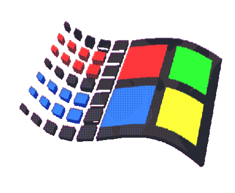

<h1>  </h1>

<!-- Experience section -->

  <h4>
    <ul>
      <li>  About me: A lazy highschooler whose always trying to automate stuff... </li>
      <li>  Fun fact: I love onedark scheme. </li>
      <li>   Not so fun fact: I love Comic Sans. (The greatest font EVER created!!!) </li>
    </ul>
  </h4>

<h2>

  

    XP
    
  

   

   
   
   
   
   
   
   
   
   
   
   
   
   
   
   

</h2>

<!-- TODO section -->

<h2>

  

    <b>TODO</b>
    
  

   

   
   
   
   
   
   
   
   
   
   
   
   
   

</h2>

<!-- Statistics -->

      
    
    
    
    

<!-- final section -->

  

    <b>  Happy Githubbing! </b>
    
  

  

      
  

<!-- random joke generator -->
<!--  -->

