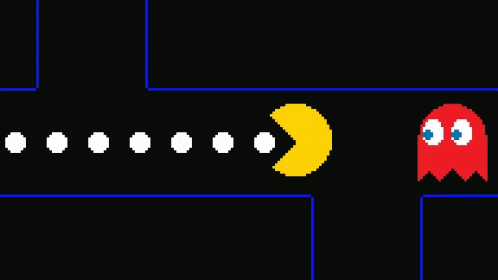

# Hi there, I'm Daniel

<!-- 
 -->

<h4 >

<b>EXPERIENCES:</b>

 

<!-- 
★★★★★
★★★★☆
★★★☆☆
★★☆☆☆
★☆☆☆☆ 
☆☆☆☆☆ 
-->

 
 
 
 
 
 
 
 
 
 
 
 
 
 

</h4>

<h4>

<b>TODO: </b>

   

 
 
 
 
 
 
 
 
 
 
 
 

</h4>

    
    
    
    

<h4>

<b>  Happy Githubbing! </b>

    

</h4>

